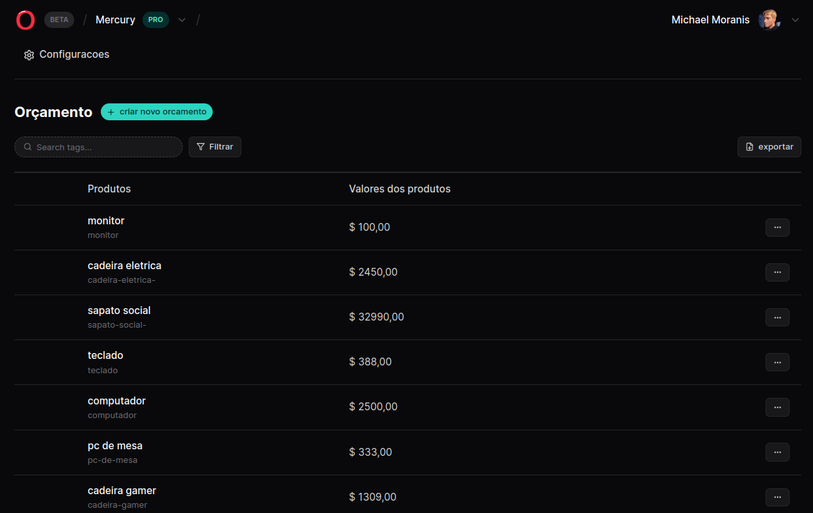
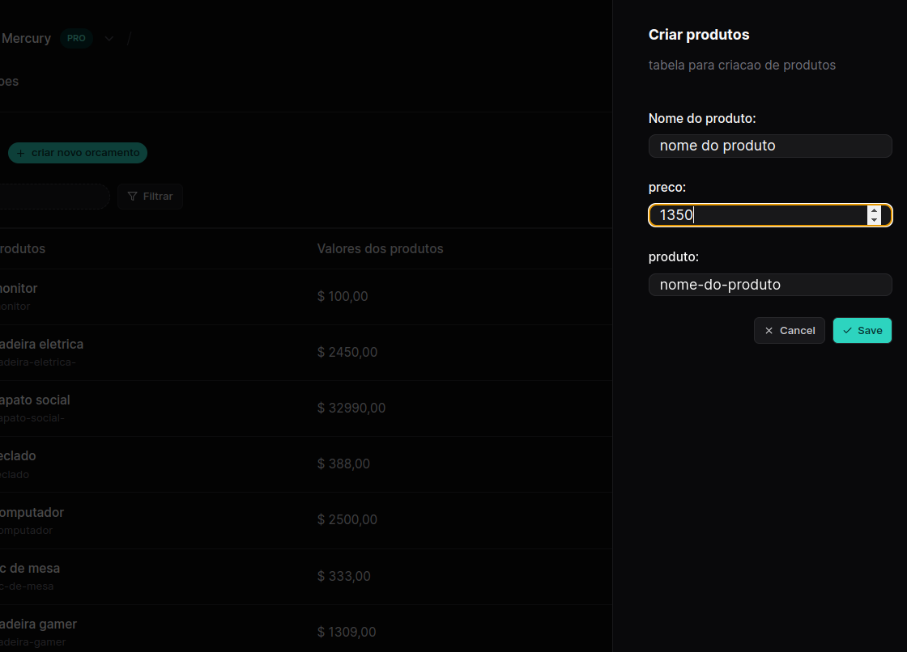

# Netuno -  aplicacao web para prestadores de servicos.

Esta é uma solução para o que desejam gerar seus orcamentos para os demais tipos de servicos, de forma simples, objetiva e intuitiva. 

## Índice

- [Visão geral](#visão-geral)
  - [O desafio](#o-desafio)
  - [Links](#links)
- [Meu processo](#meu-processo)
  - [Construído com](#construído-com)
  - [O que aprendi](#o-que-eu-aprendi)
  - [Desenvolvimento contínuo](#desenvolvimento-contínuo)
- [Autor](#autor)

## Visão geral

### O desafio

Os usuários desta aplicacao web sao capazes de:

- Ver o layout ideal do aplicativo dependendo do tamanho da tela do dispositivo
- Veja os estados de foco para todos os elementos interativos na página
- Adicione novos produtos à tabela central clicando no botao "gerar orcamento".
- Excluir produtos da tabela.
- Filtrar por produtos especificos na tabela.
- Limpar todos os todos concluídos
- Alternar modo claro e escuro

### Interface da aplicacao.



### Barra Lateral com formulario de insercao de produtos.




### Links

- URL da solução: [https://github.com/MichaelMoranis/react-na-pratica/tree/main](https://github.com/MichaelMoranis/react-na-pratica/tree/main)
- URL do site ativo: [Adicione o URL do site ativo aqui](https://your-live-site-url.com)

## Meu processo

### Construído com
1
- Marcação HTML5 semântica
- [Tailwind CSS](https://tailwindcss.com/) para estilizacao.
- Fluxo de trabalho com design responsivo voltado para dispositivos móveis e notebooks.
- [React](https://reactjs.org/) - Biblioteca JS
- [Radix UI](https://www.radix-ui.com/) - Uma biblioteca de componentes de código aberto otimizada para desenvolvimento rápido, fácil manutenção e acessibilidade. 
- [React Hook Form](https://react-hook-form.com/) - Formulários de alto desempenho, flexíveis e extensíveis com validação fácil de usar.
- [TypeScript](https://www.typescriptlang.org/) - TypeScript SuperSet do Javascript 
- [Zod](https://styled-components.com/) -  Zod é uma primeira biblioteca de declaração e validação de esquema TypeScript.

### O que eu aprendi

Este projeto foi uma continuacao de um projeto desenvolvido pelo Diego da Rockeseat, onde eu dei um rumo bem diferente para a aplicacao, transformando-a em uma aplicacao de geracao de orcamento para prestadores de servicos.

Enfrentei um bug no meu input de preco, que sempre me retornava uma string, e nao era enviado para a "API" json, porque o input sempre eh tratado como string pelo navegador, tava recebendo esse erro utilizando a lib zod: 

```html
    <div className="space-y-2">
        <label className="text-sm font-medium block" htmlFor="amountOfVideos">preco:</label>
        <input
          className="border border-zinc-800 rounded-lg px-3 px-y bg-zinc-800/50 w-full"
          placeholder="$"
          type="number"
        />
      </div>
```
mas meu TypeScript com zod estava assim: 

```ts
  const createTagSchema = z.object({
    amountOfVideos: z.number(),
    title: z.string().min(3, { message: 'Minimum 03 characters.' }),
  
  })
```
onde existia um bug, sem envio de dados do campo para a api, corrigi-o assim: 

```ts
  const createTagSchema = z.object({
    amountOfVideos: z.string(),
    title: z.string().min(3, { message: 'Minimum 03 characters.' }),
  })
  ```
  e fazendo a conversao no envio para a api: 

  ```ts
      const { mutateAsync } = useMutation({
    mutationFn: async ({ title, amountOfVideos }: CreateTagSchema) => {

      await new Promise(resolve => setTimeout(resolve, 1000))

      await fetch('http://localhost:3333/tags', {
       method: 'Post',
       body: JSON.stringify({
         title,
         slug, 
         amountOfVideos: Number(amountOfVideos),
       })
      })
    },
    onSuccess: () => {
      queryClient.invalidateQueries({
        queryKey: ["get-tags"],
      })
    }
   })
  ```

  nesta linha: 
  ```ts
       amountOfVideos: Number(amountOfVideos),
  ``` 
  convertendo a variavel para numero.


### Desenvolvimento contínuo

Desejo continuar aprendendo a usar essas ferramentas pois sao de grande valia para o desenvolvimento dos meu projetos, desejo continuar mantendo essa aplicacao, e com ela, conseguir ingressar no mercado de trabalho.


## Autor

- Site - [Netuno](https://www.seu-site.com)
- Instagram - [@moranisdev](https://www.instagram.com/moranisdev)


